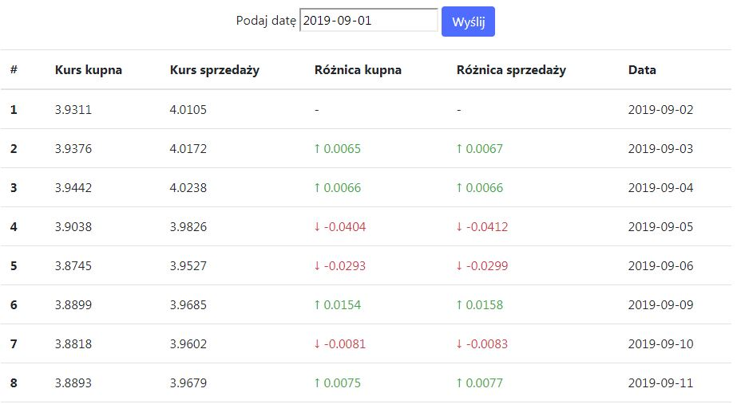

# NBP Web API
> NBP Web API to check currency exchange rates with buy and sell prices and price differences in dayss

## Table of contents
* [Screenshots](#screenshots)
* [Technologies](#technologies)
* [Setup](#setup)
* [Contact](#contact)

## Screenshots

## Technologies
* Bootstrap - version 4.3.1
* jQuery - https://ajax.googleapis.com/ajax/libs/jquery/3.4.1/jquery.min.js
* Popper - https://cdnjs.cloudflare.com/ajax/libs/popper.js/1.14.7/umd/popper.min.js
## Setup
For setup you need just download it and run on the web server.
You don't need any extras.

## Contact
Created by [@appos](https://www.appos.pl/)